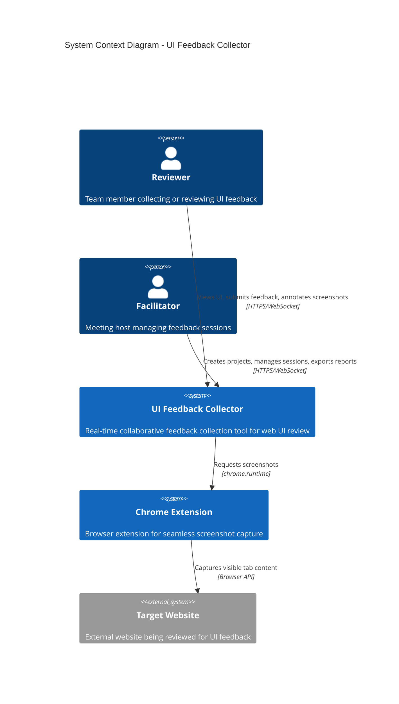
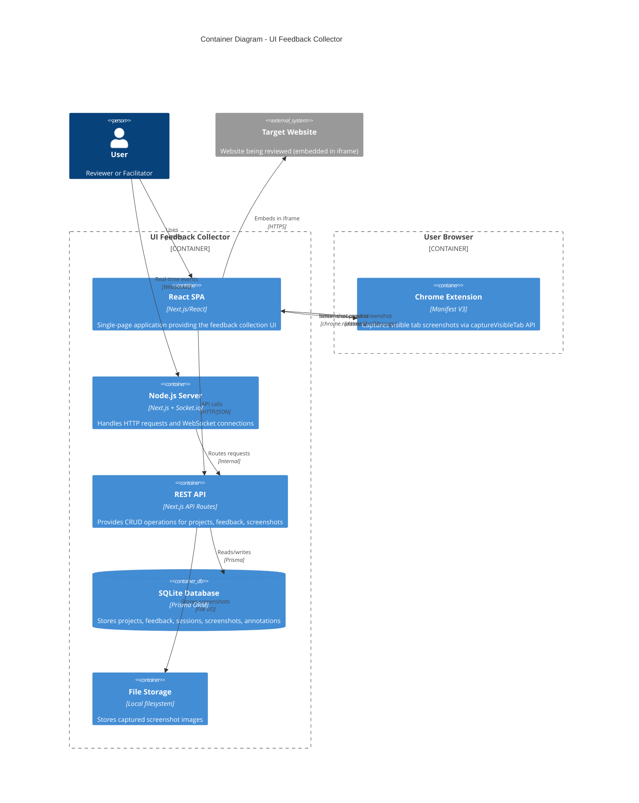
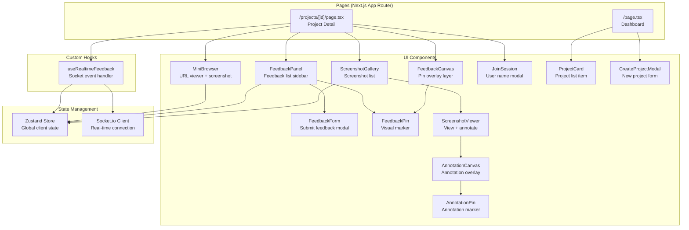
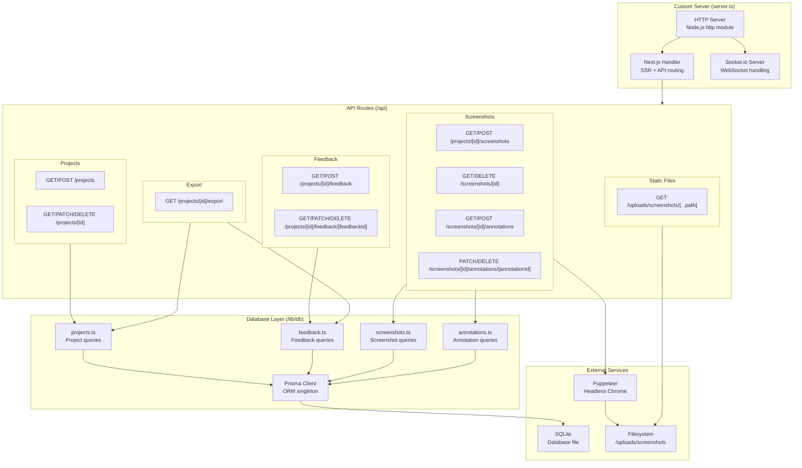
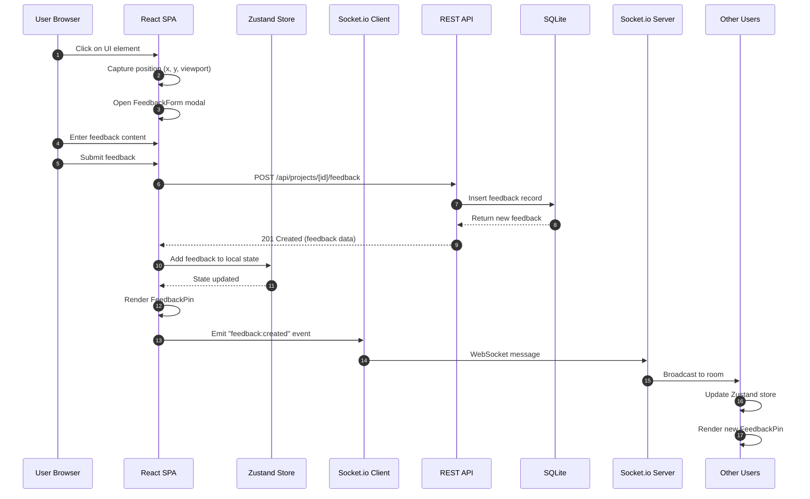
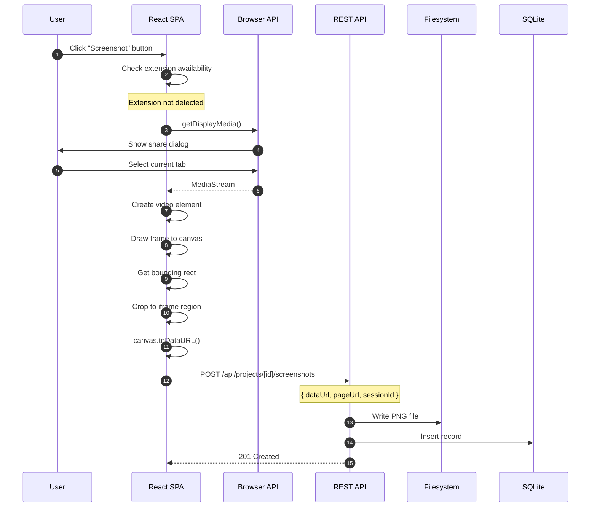
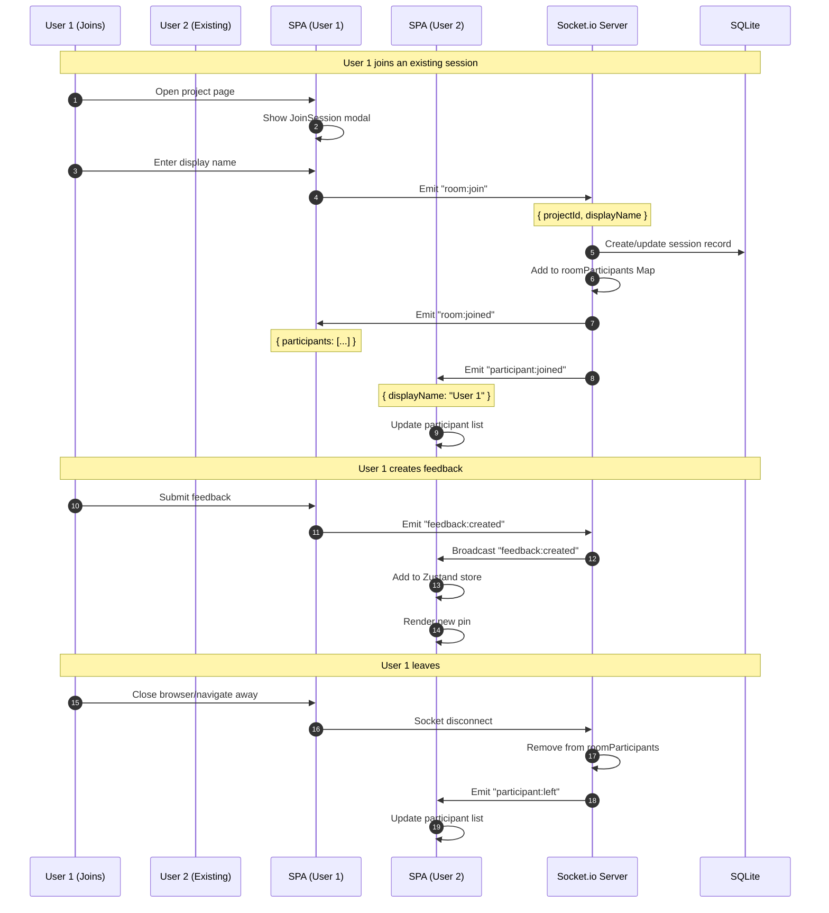
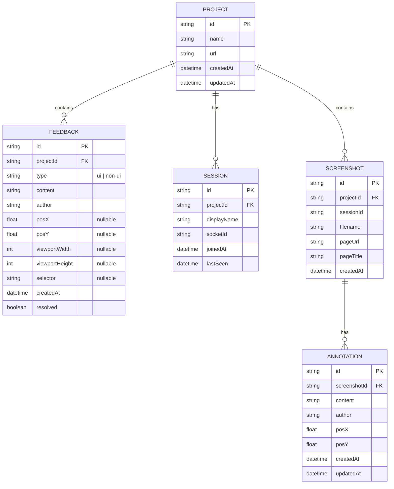
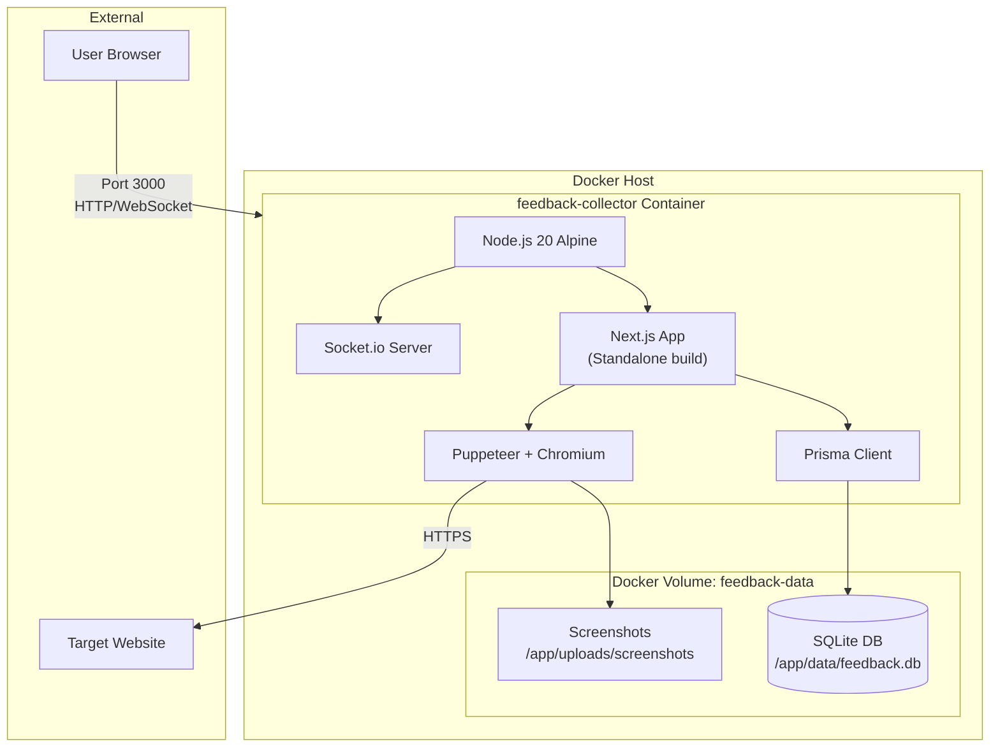
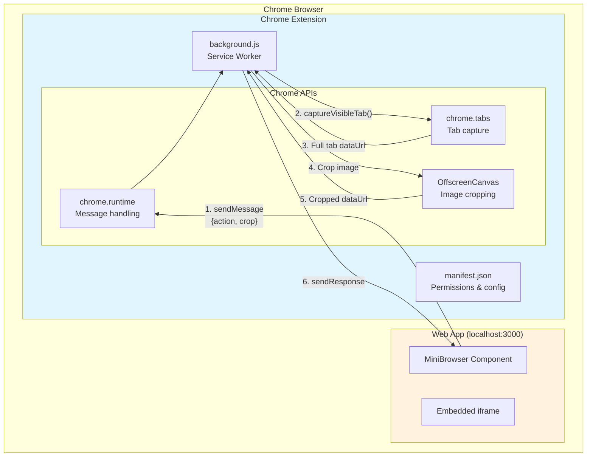

# UI Feedback Collector - Architecture Diagrams

This document contains architecture diagrams for the UI Feedback Collector application, a real-time collaborative tool for gathering UI feedback during meetings.

---

## System Context

High-level view showing the system and its interactions with users and external systems.



### Legend
- **Reviewer**: Any team member participating in the feedback session
- **Facilitator**: The person who creates projects and manages the feedback collection
- **UI Feedback Collector**: The main application
- **Chrome Extension**: Optional extension for seamless screenshot capture
- **Target Website**: The external website being reviewed

### Assumptions
- Multiple users can participate in the same feedback session simultaneously
- Target website is embedded in an iframe within the app
- Chrome extension enables instant screenshots; falls back to Screen Capture API
- Users access the system through Chrome browser (for extension features)

---

## Container Diagram

Shows the major technical building blocks and how they interact.



### Legend
- **React SPA**: Client-side application built with Next.js and React
- **Node.js Server**: Custom HTTP server wrapping Next.js with Socket.io
- **REST API**: Next.js API routes for data operations
- **SQLite Database**: File-based database using Prisma ORM
- **File Storage**: Local directory for screenshot PNG files
- **Chrome Extension**: Browser extension for seamless screenshot capture

### Assumptions
- Single-server deployment (not distributed)
- SQLite is sufficient for expected data volume
- Chrome extension is optional (fallback to Screen Capture API)

---

## Component Diagram - Frontend

Detailed view of the React frontend components and their relationships.



### Legend
- **Pages**: Next.js App Router page components
- **UI Components**: React components for UI rendering
- **State Management**: Client-side state (Zustand) and real-time communication (Socket.io)
- **Custom Hooks**: React hooks for business logic

### Assumptions
- Zustand store is the single source of truth for client state
- Socket.io handles all real-time synchronization
- Components follow a hierarchical composition pattern

---

## Component Diagram - Backend

Shows the server-side components and data access layer.



### Legend
- **Custom Server**: Node.js HTTP server with Next.js and Socket.io integration
- **API Routes**: RESTful endpoints following Next.js App Router conventions
- **Database Layer**: Prisma-based data access functions
- **External Services**: SQLite database, filesystem, and Puppeteer

### Assumptions
- Single Prisma client instance (singleton pattern)
- API routes handle validation and error responses
- Screenshot files are stored locally (not cloud storage)

---

## Sequence Diagram - Feedback Submission

Shows the flow when a user submits UI feedback.



### Legend
- **User Browser**: The user's web browser
- **React SPA**: The frontend application
- **Zustand Store**: Client-side state management
- **Socket.io Client/Server**: Real-time communication layer
- **REST API**: Backend API endpoints
- **SQLite**: Database storage

### Assumptions
- Feedback is persisted before broadcasting
- All users in the same project room receive updates
- Optimistic UI updates are applied locally first

---

## Sequence Diagram - Screenshot Capture (with Extension)

Shows the client-side screenshot capture flow using the Chrome extension.

```mermaid
sequenceDiagram
    autonumber
    participant U as User
    participant SPA as React SPA
    participant Ext as Chrome Extension
    participant API as REST API
    participant FS as Filesystem
    participant DB as SQLite

    U->>SPA: Enter URL in MiniBrowser
    SPA->>SPA: Load target site in iframe
    U->>SPA: Interact with embedded site
    U->>SPA: Click "Screenshot" button

    SPA->>SPA: Get iframe bounding rect
    SPA->>Ext: chrome.runtime.sendMessage
    Note over Ext: { action: "captureScreenshot", crop: { x, y, width, height, scale } }

    Ext->>Ext: captureVisibleTab()
    Ext->>Ext: Crop to iframe region
    Note over Ext: Using OffscreenCanvas
    Ext-->>SPA: { dataUrl: "data:image/png;base64,..." }

    SPA->>API: POST /api/projects/[id]/screenshots
    Note over API: { dataUrl, pageUrl, sessionId }

    API->>API: Decode base64 to buffer
    API->>FS: Write PNG to /uploads/screenshots/
    FS-->>API: File path

    API->>DB: Insert screenshot record
    DB-->>API: Return screenshot data

    API-->>SPA: 201 Created (screenshot metadata)
    SPA->>SPA: Update ScreenshotGallery
```

### Legend
- **User**: The user interacting with the app
- **React SPA**: The frontend MiniBrowser component
- **Chrome Extension**: Background service worker with captureVisibleTab permission
- **REST API**: Backend screenshot endpoint
- **Filesystem**: Local file storage
- **SQLite**: Database for metadata

### Assumptions
- Chrome extension is installed and configured
- Extension has `host_permissions: ["<all_urls>"]`
- devicePixelRatio is used for correct scaling on HiDPI displays
- Cropping happens in the extension before sending to the app

---

## Sequence Diagram - Screenshot Capture (Fallback)

Shows the fallback flow when Chrome extension is not available.



### Legend
- **Browser API**: Screen Capture API (getDisplayMedia)
- Dialog is shown to user for permission

### Assumptions
- User must grant screen share permission each time
- Only works on HTTPS or localhost
- May capture browser UI momentarily before cropping

---

## Sequence Diagram - Real-time Session Sync

Shows how multiple users stay synchronized in a session.



### Legend
- **User 1/2**: Different users in the same session
- **SPA**: React frontend for each user
- **Socket.io Server**: Real-time event hub
- **SQLite**: Session persistence

### Assumptions
- Each project has its own Socket.io "room"
- Participants are tracked both in memory (Map) and database
- Disconnect events trigger cleanup automatically

---

## Data Model (ERD)

Entity-relationship diagram showing the database schema.



### Legend
- **PROJECT**: Container for a feedback collection session
- **FEEDBACK**: Individual feedback items (UI or general)
- **SESSION**: Active user sessions per project
- **SCREENSHOT**: Captured page screenshots
- **ANNOTATION**: Comments on specific screenshots

### Assumptions
- UUIDs are used for all primary keys
- Feedback position is nullable (only set for UI feedback)
- Sessions track active WebSocket connections
- Cascade delete from PROJECT removes all related records

---

## Deployment Diagram

Shows the Docker-based deployment topology.



### Legend
- **Docker Host**: The machine running Docker
- **feedback-collector Container**: The application container
- **Docker Volume**: Persistent storage for database and screenshots
- **External**: Users and external websites

### Assumptions
- Single container deployment (not microservices)
- Persistent volume ensures data survives container restarts
- Port 3000 exposed for HTTP and WebSocket traffic
- Puppeteer uses bundled Chromium

---

## Component Diagram - Chrome Extension

Shows the Chrome extension architecture for screenshot capture.



### Legend
- **MiniBrowser Component**: React component managing iframe and screenshot button
- **manifest.json**: Extension configuration with permissions
- **background.js**: Service worker handling capture requests
- **Chrome APIs**: Browser APIs for messaging, tab capture, and image processing

### Configuration

```json
{
  "manifest_version": 3,
  "permissions": ["activeTab"],
  "host_permissions": ["<all_urls>"],
  "externally_connectable": {
    "matches": ["http://localhost:*/*"]
  }
}
```

### Assumptions
- Extension ID must be configured in web app via `NEXT_PUBLIC_EXTENSION_ID`
- `externally_connectable` restricts which origins can message the extension
- `host_permissions: ["<all_urls>"]` required for captureVisibleTab on any site

---

## Technology Stack Summary

| Layer | Technology |
|-------|------------|
| **Frontend** | Next.js 14, React 18, Tailwind CSS, Zustand |
| **Real-time** | Socket.io (WebSocket) |
| **Backend** | Node.js, Next.js API Routes |
| **Database** | SQLite + Prisma ORM |
| **Screenshot** | Chrome Extension (captureVisibleTab) with Screen Capture API fallback |
| **Deployment** | Docker + Docker Compose |

---

## File Structure Reference

```
ui-feedback-collector/
├── extension/            # Chrome extension for screenshots
│   ├── manifest.json     # Extension config (MV3)
│   └── background.js     # Service worker (captureVisibleTab)
├── src/
│   ├── app/              # Next.js App Router (pages + API)
│   ├── components/       # React UI components
│   │   └── MiniBrowser.tsx  # Iframe + extension integration
│   ├── hooks/            # Custom React hooks
│   └── lib/
│       ├── db/           # Prisma database functions
│       ├── socket/       # Socket.io client/events
│       ├── export/       # Markdown export
│       └── store/        # Zustand state store
├── prisma/               # Database schema + migrations
├── uploads/              # Screenshot file storage
├── server.ts             # Custom HTTP/Socket.io server
├── Dockerfile            # Container build config
└── docker-compose.yml    # Deployment config
```
