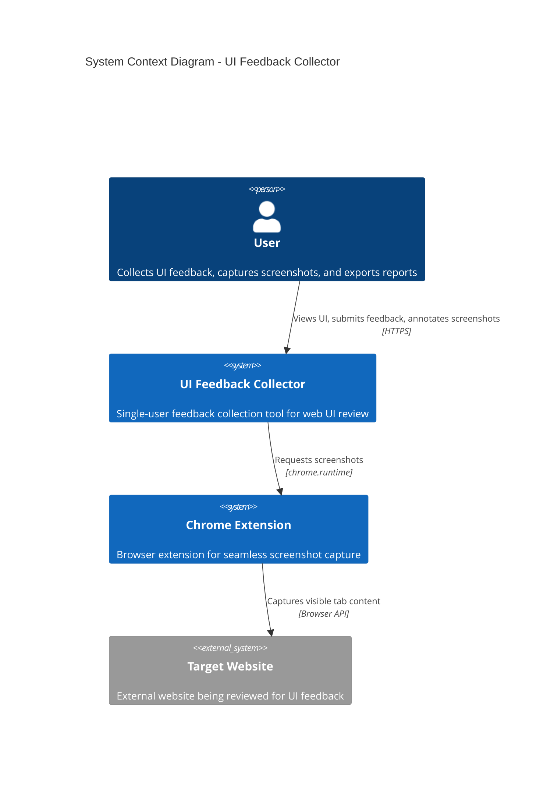
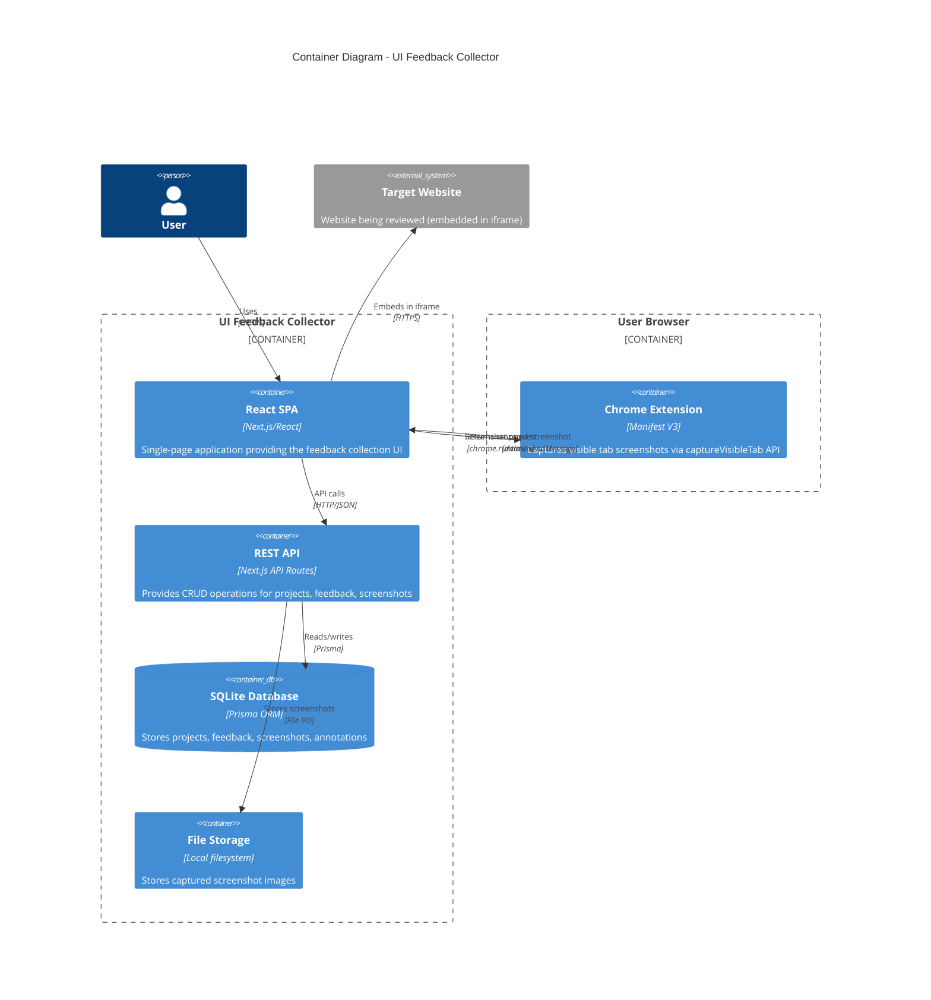
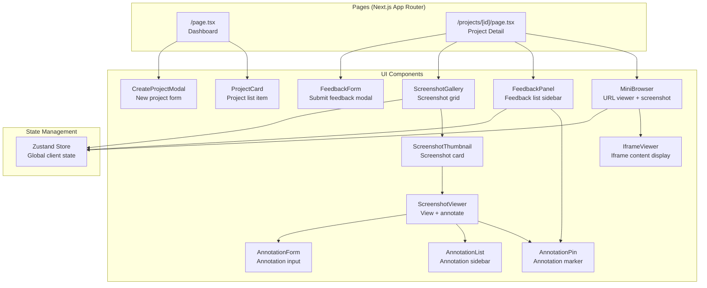
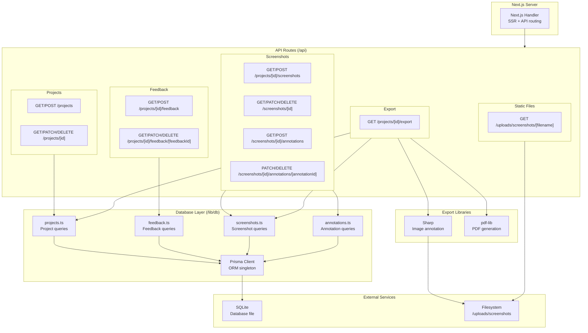
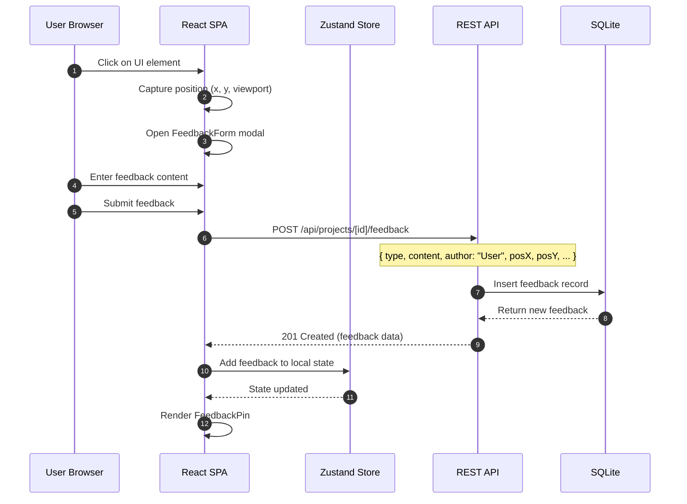
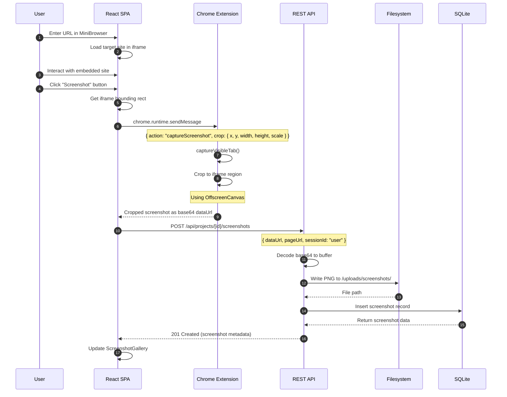
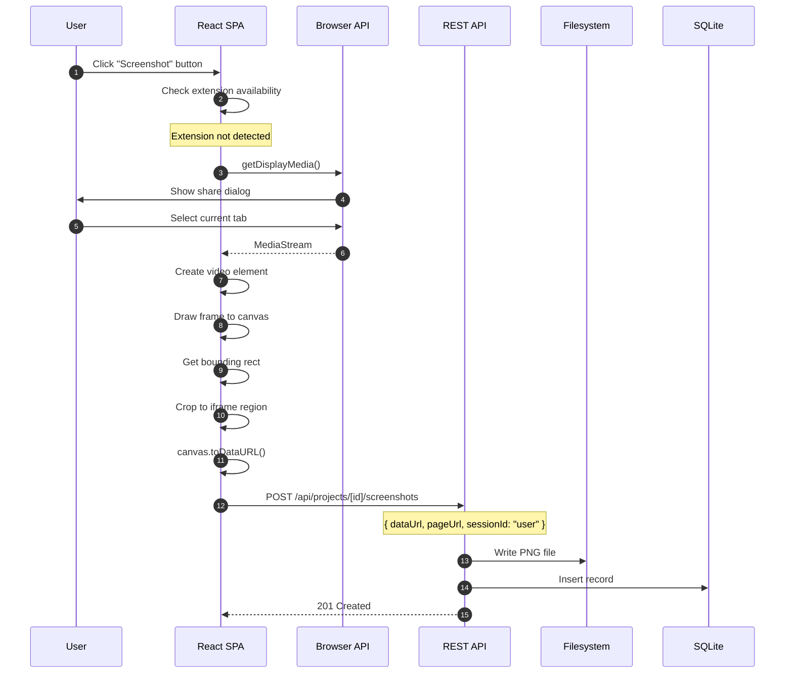
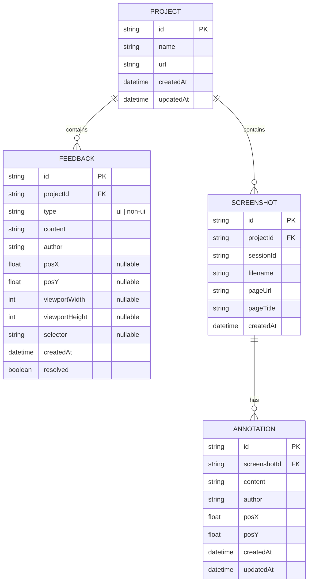
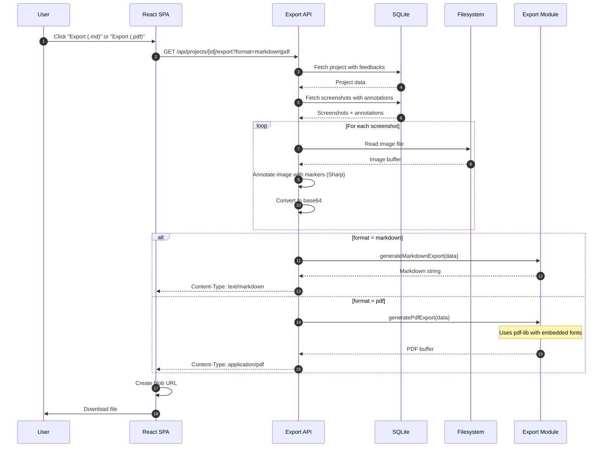
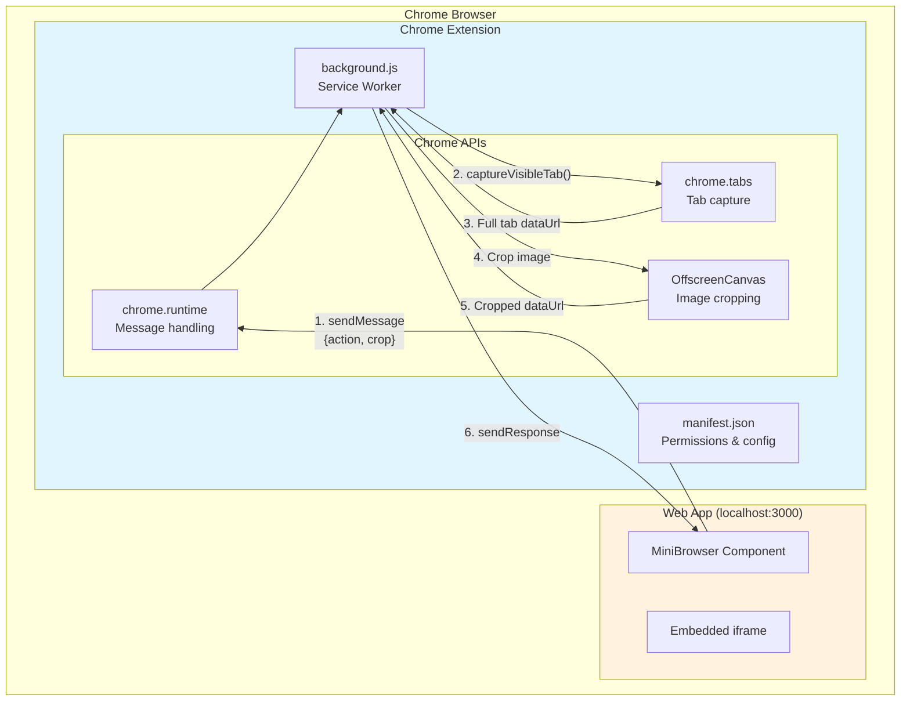

# SnapFeed - Architecture Diagrams

This document contains architecture diagrams for SnapFeed, a single-user tool for gathering UI feedback on web applications.

---

## System Context

High-level view showing the system and its interactions with the user and external systems.



### Legend
- **User**: The person collecting feedback on a website
- **UI Feedback Collector**: The main Next.js application
- **Chrome Extension**: Optional extension for seamless screenshot capture
- **Target Website**: The external website being reviewed

### Assumptions
- Single-user application (no real-time collaboration)
- Target website is embedded in an iframe within the app
- Chrome extension enables instant screenshots; falls back to Screen Capture API
- User accesses the system through Chrome browser (for extension features)

---

## Container Diagram

Shows the major technical building blocks and how they interact.



### Legend
- **React SPA**: Client-side application built with Next.js and React
- **REST API**: Next.js API routes for data operations
- **SQLite Database**: File-based database using Prisma ORM
- **File Storage**: Local directory for screenshot PNG files
- **Chrome Extension**: Browser extension for seamless screenshot capture

### Assumptions
- Single-server deployment using standard Next.js server
- SQLite is sufficient for single-user data volume
- Chrome extension is optional (fallback to Screen Capture API)

---

## Component Diagram - Frontend

Detailed view of the React frontend components and their relationships.



### Legend
- **Pages**: Next.js App Router page components
- **UI Components**: React components for UI rendering
- **State Management**: Zustand for client-side state

### Assumptions
- Zustand store is the single source of truth for client state
- Components follow a hierarchical composition pattern
- Author is fixed as "User" for all feedback and annotations

---

## Component Diagram - Backend

Shows the server-side components and data access layer.



### Legend
- **Next.js Server**: Standard Next.js development/production server
- **API Routes**: RESTful endpoints following Next.js App Router conventions
- **Database Layer**: Prisma-based data access functions
- **External Services**: SQLite database and filesystem storage
- **Export Libraries**: Sharp for image annotation, pdf-lib for PDF generation

### Assumptions
- Single Prisma client instance (singleton pattern)
- API routes handle validation and error responses
- Screenshot files are stored locally (not cloud storage)
- PDF export uses embedded fonts (no external font files)

---

## Sequence Diagram - Feedback Submission

Shows the flow when a user submits UI feedback.



### Legend
- **User Browser**: The user's web browser
- **React SPA**: The frontend application
- **Zustand Store**: Client-side state management
- **REST API**: Backend API endpoints
- **SQLite**: Database storage

### Assumptions
- Feedback is persisted to database before updating UI
- Author is always "User" (single-user mode)
- Position data is stored as percentages for viewport independence

---

## Sequence Diagram - Screenshot Capture (with Extension)

Shows the client-side screenshot capture flow using the Chrome extension.



### Legend
- **User**: The user interacting with the app
- **React SPA**: The frontend MiniBrowser component
- **Chrome Extension**: Background service worker with captureVisibleTab permission
- **REST API**: Backend screenshot endpoint
- **Filesystem**: Local file storage
- **SQLite**: Database for metadata

### Assumptions
- Chrome extension is installed and configured
- Extension has `host_permissions: ["<all_urls>"]`
- devicePixelRatio is used for correct scaling on HiDPI displays
- Cropping happens in the extension before sending to the app

---

## Sequence Diagram - Screenshot Capture (Fallback)

Shows the fallback flow when Chrome extension is not available.



### Legend
- **Browser API**: Screen Capture API (getDisplayMedia)
- Dialog is shown to user for permission

### Assumptions
- User must grant screen share permission each time
- Only works on HTTPS or localhost
- May capture browser UI momentarily before cropping

---

## Data Model (ERD)

Entity-relationship diagram showing the database schema.



### Legend
- **PROJECT**: Container for a feedback collection session
- **FEEDBACK**: Individual feedback items (UI or general)
- **SCREENSHOT**: Captured page screenshots
- **ANNOTATION**: Comments on specific screenshots

### Assumptions
- CUIDs are used for all primary keys
- Feedback position is nullable (only set for UI feedback)
- Cascade delete from PROJECT removes all related records
- Author is always "User" for single-user mode

---

## Sequence Diagram - Export Flow

Shows the flow when a user exports feedback to Markdown or PDF.



### Legend
- **Export API**: `/api/projects/[id]/export` route
- **Export Module**: `src/lib/export/markdown.ts` and `src/lib/export/pdf.ts`
- **Sharp**: Image processing library for annotation markers

### Assumptions
- Screenshots are annotated with numbered markers at annotation positions
- PDF uses pdf-lib with embedded StandardFonts (Helvetica)
- Export is self-contained (images embedded as base64)

---

## Component Diagram - Chrome Extension

Shows the Chrome extension architecture for screenshot capture.



### Legend
- **MiniBrowser Component**: React component managing iframe and screenshot button
- **manifest.json**: Extension configuration with permissions
- **background.js**: Service worker handling capture requests
- **Chrome APIs**: Browser APIs for messaging, tab capture, and image processing

### Configuration

```json
{
  "manifest_version": 3,
  "permissions": ["activeTab"],
  "host_permissions": ["<all_urls>"],
  "externally_connectable": {
    "matches": ["http://localhost:*/*"]
  }
}
```

### Assumptions
- Extension ID must be configured in web app via `NEXT_PUBLIC_EXTENSION_ID`
- `externally_connectable` restricts which origins can message the extension
- `host_permissions: ["<all_urls>"]` required for captureVisibleTab on any site

---

## Technology Stack Summary

| Layer | Technology |
|-------|------------|
| **Frontend** | Next.js 14, React 18, Tailwind CSS, Zustand |
| **Backend** | Next.js API Routes |
| **Database** | SQLite + Prisma ORM |
| **Screenshot** | Chrome Extension (captureVisibleTab) with Screen Capture API fallback |
| **Image Processing** | Sharp (annotation markers) |
| **Export** | pdf-lib (PDF), custom markdown generator |

---

## File Structure Reference

```
SnapFeed/
├── extension/              # Chrome extension for screenshots
│   ├── manifest.json       # Extension config (MV3)
│   └── background.js       # Service worker (captureVisibleTab)
├── src/
│   ├── app/                # Next.js App Router (pages + API)
│   │   ├── api/            # REST API routes
│   │   │   ├── projects/   # Project and feedback endpoints
│   │   │   ├── screenshots/# Screenshot and annotation endpoints
│   │   │   └── uploads/    # Static file serving
│   │   ├── projects/[id]/  # Project detail page
│   │   ├── layout.tsx      # Root layout
│   │   └── page.tsx        # Dashboard
│   ├── components/         # React UI components
│   │   ├── MiniBrowser.tsx       # Iframe + extension integration
│   │   ├── FeedbackPanel.tsx     # Feedback sidebar
│   │   ├── FeedbackForm.tsx      # Feedback input modal
│   │   ├── ScreenshotGallery.tsx # Screenshot grid
│   │   ├── ScreenshotViewer.tsx  # Full screenshot view
│   │   ├── ScreenshotThumbnail.tsx
│   │   ├── AnnotationPin.tsx     # Position markers
│   │   ├── AnnotationForm.tsx
│   │   ├── AnnotationList.tsx
│   │   ├── IframeViewer.tsx
│   │   ├── ProjectCard.tsx
│   │   └── CreateProjectModal.tsx
│   └── lib/
│       ├── db/             # Prisma database functions
│       │   ├── prisma.ts
│       │   ├── projects.ts
│       │   ├── feedback.ts
│       │   ├── screenshots.ts
│       │   └── annotations.ts
│       ├── export/         # Export functionality
│       │   ├── markdown.ts       # Markdown generation
│       │   ├── pdf.ts            # PDF generation (pdf-lib)
│       │   └── annotateImage.ts  # Image annotation (Sharp)
│       └── store/
│           └── useStore.ts # Zustand state store
├── prisma/
│   └── schema.prisma       # Database schema
├── uploads/screenshots/    # Screenshot file storage
└── package.json            # Dependencies and scripts
```
